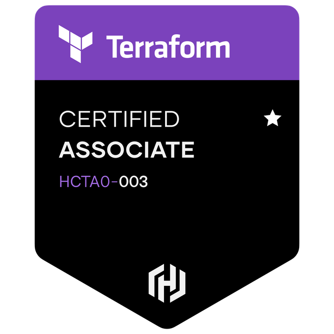

# Hello, I'm Luke Welden 👋

I'm an AWS DevOps Engineer based in the UK with a passion for all things DevOps. I currently exploring the world of Back End Software Engineering! 

## About Me

- AWS DevOps Engineer 🚀
- Multi-certified AWS Professional 📜
- Embracing the world of DevOps while exploring Backend Software Development 🌐
- Active on [lukewelden-mobysoft](https://github.com/lukewelden-mobysoft) for work-related projects 🏢
- Here, you'll find my personal coding adventures and projects 🚀

## Technologies 
 <a href="https://www.python.org" target="_blank" rel="noreferrer"> 
<a href="https://nodejs.org" target="_blank" rel="noreferrer"> 
<a href="https://expressjs.com" target="_blank" rel="noreferrer"> 

## Proffesional Certification

Feel free to explore my projects and connect with me. Let's learn, build, and grow together! 📚

<!--
**lukewelden/lukewelden** is a ✨ _special_ ✨ repository because its `README.md` (this file) appears on your GitHub profile.

Here are some ideas to get you started:

- 🔭 I’m currently working on ...
- 🌱 I’m currently learning ...
- 👯 I’m looking to collaborate on ...
- 🤔 I’m looking for help with ...
- 💬 Ask me about ...
- 📫 How to reach me: ...
- 😄 Pronouns: ...
- ⚡ Fun fact: ...
-->
